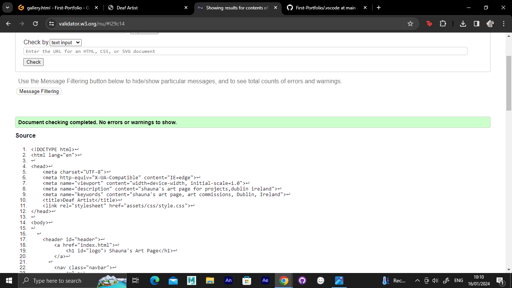

Hello. welcome to my first Portfolio Project 
I've made a page about my art

# Contents 

<a>My Goals</a>

## User Stories

1. As a User interested in Art/Drawing, I would like to see more artists promoting their work through a website rather on social medias. 

2. As a user, I would expect to see an introduction of the person themself to explain why they like art, what is their passion and especially the type of art they do.

3. As a user in art, I would love to see a variety of art pieces they worked on and make a Gallery of it to show people an idea on what they can do. 

4. As a user, I would expect to see description of each piece that was created by the Artist

5. As a user, I would expect to see a Gallery and Contact me that is easily used in the Navigation Bar.

6. I would expect to see the social medias link as most artists are now sharing their work through social medias.

7. If i would like to contact the artist if I'm interested, getting in touch should be no problem. 

## My wireframes 
These are my wireframes that i hope to aim for the final product.
 

 

## Deployment 

<a>How I deployed my project.</a>

My project was deployed by using the Github pages. 

In order to get this done, here are the steps:

Firstly, go to the menu, and click the preffered repository

Click the settings button which can be easily identified by the gear icon in the menu right hand side. 

On the left hand side, scroll down until pages are seen in the Code and automation.

In the build and deployment section, click the Branch and a dropdown menu will appear, and chose the main branch

Click save after this step and a confirmation of deployment should be confirmed shortly. 

To know this, a green colored box with message is received saying "Your site is published at" with a web address. 

# Testing 

So far, index.html and gallery.html has been tested with no errors.

