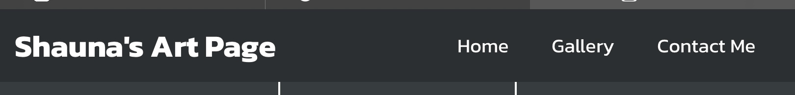
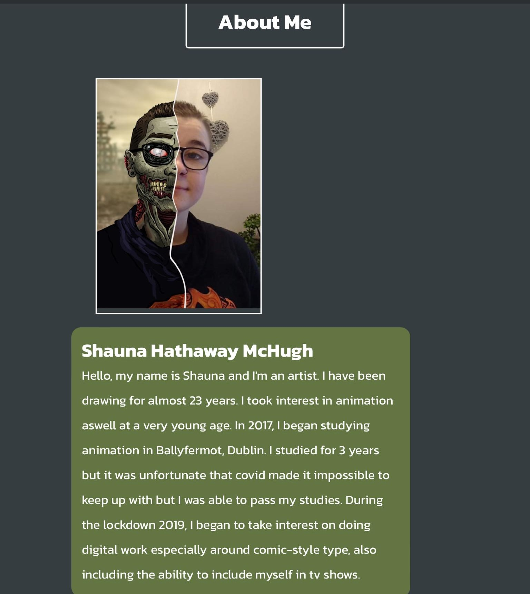
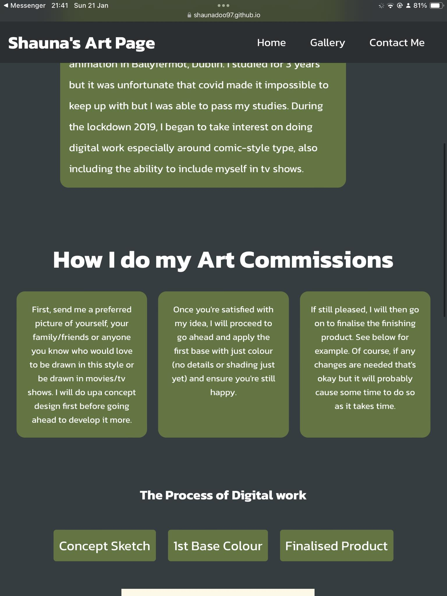
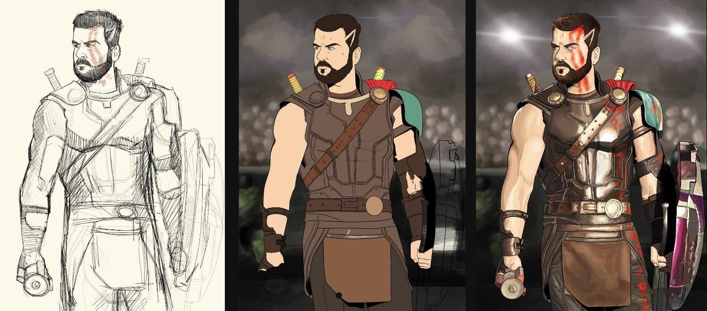
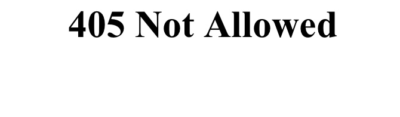
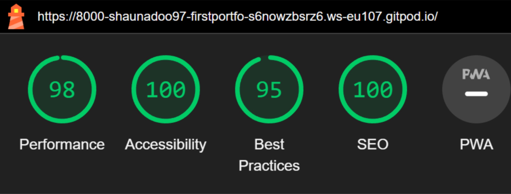

Hello. welcome to my first Portfolio Project 
I've made a page about my art.
This is where I would like to use a website to help promote my work and show the type of digital work that I can make. 

## Contents 

[User Stories](#user-stories "Go to User-stories")

[My wireframes](#my-wireframes "Go to my-wireframes")

[My Colour Schemes](#my-colour-schemes "Go to my-colour-schemes")

[General](#general "Go to general")

[Testing and Code Validation](#testing-and-code-validation "Go to my-wireframes")

[Accessibility](#accessibility  "Go to my-accessibility")

[Deployment ](#deployment "Go to my-deployment")

[Testing and Code Validation](#testing-and-code-validation "Go to testing-and-code-validation")

[Credits and Codes](#credits-and-codes "Go to credits-and-codes")

## User Stories
### The goal of a first time user to the Art Page website:

1. As a User interested in Art/Drawing, I would like to see more artists promoting their work through a website rather on social medias. 

2. As a user, I would expect to see an introduction of the person themself to explain why they like art, what is their passion and especially the type of art they do.

3. As a user in art, I would love to see a variety of art pieces they worked on and make a Gallery of it to show people an idea on what they can do. 

4. As a user, I would expect to see description of each piece that was created by the Artist

5. As a user, I would expect to see a Gallery and Contact me that is easily used in the Navigation Bar.

6. I would expect to see the social medias link as most artists are now sharing their work through social medias.

7. If i would like to contact the artist if I'm interested, getting in touch should be no problem. 

## My wireframes 
These are my wireframes that i hope to aim for the final product.
Website:

 

  
 

Phone: 

## My Colour Schemes 
This is my color scheme: 

I chose these to be my colours,it's not easy choosing for a background when my art pieces
have lots of bright vibrant colours involved. so this is why I thought it was best to do 
a dark background to help make my work stand out. I chose green to be for the letters as my zombie picture has green, i thought it would be a nice touch to refer to the picture. 

## General 

This is to talk about what I've included in my site. 
<ol>Header
<li>My header contains a Navigation Bar that should be responsive to all screen sizes</li>
<li> The Logo to the left functions as a link back to the Home page</li>
<li>It has 3 seperate links to go to different pages such as home page, gallery and contact us. </li>
<li> all links in the bar works great and will bring you to each page.</li>
</ol>

<ol>Footer
<li>The footer is placed fix at the end of the screen</li>
<li>It has 3 different links which are for Facebook, Instagram and YouTube</li>
<li> All links work and run great as it will bring you to seperate external tabs</li>
</ol>

<ol>Homepage
<li>The home page will contain an image of myself being introduced and show people visually on what I can do</li>

<li>There is a progress section at the end to show step by step how I work on my art pieces</li>

<li>I've included the 3 working images  </li>
</ol>

<ol> Gallery 
<li> The Gallery is where I can show visually the style of art I like</li>
<li> On a desktop, a row of 4 images will show, on a tablet will show two rows and then on the phone it will be showing each picture individually scrolling down</li>
</ol>

<ol> Contact Me
<li> The Contact page is where people would be able to request for an art commission off me</li>
<li> I've included the required action in the inputs so you can not submit without putting the information in</li>
</ol>

<ol> Submit button feature 

<li> Unfortunately I've tried to include a thank you page but it did not turn out great for me and I had no time to finish this part</li>
<li>I've tried to include a thank you html but with time running out, I had to leave it remain unfinished</li>
<li>however I do plan on learning this part again and I will understand how this feature works soon enough.</li>
</ol> 

## Accessibility 
I've used Lighthouse in Chrome Devtools to confirm and test my site is running okay. 

Lighthouse reports on the Home Page

## Deployment 
How I deployed my project:

My project was deployed by using the Github pages. 

In order to get this done, here are the steps:

Firstly, go to the menu, and click the preffered repository

Click the settings button which can be easily identified by the gear icon in the menu right hand side. 

On the left hand side, scroll down until pages are seen in the Code and automation.

In the build and deployment section, click the Branch and a dropdown menu will appear, and chose the main branch

Click save after this step and a confirmation of deployment should be confirmed shortly. 

To know this, a green colored box with message is received saying "Your site is published at" with a web address. My website is live at : https://shaunadoo97.github.io/First-Portfolio/

## Testing and Code Validation

To test and validate my codes to ensure there are no errors, I've used W3C Markup Validator
to test all of the pages: https://validator.w3.org/
So far, index.html gallery.html and contact.html has been tested with no errors.

Home Page html

Gallery html

Contact html

I've also used W3C CSS Validation Service to check if there are no errors in my CSS: https://jigsaw.w3.org/css-validator/

 

## Credits and Codes

Ensuring that I will mention and credit to those who helped me with my project to try understand now things work.
I used Love Running Navbar and Footer to help me get started but tweaked in my own ways.

Home Page - Love Running Project to help me get started, then moving on from there to set my own homepage up. 
Also tried to use https://www.youtube.com/watch?v=oLgtucwjVII&t=48s as practice at first but didn't like how my page looked so I changed it completely. 
I've practiced using this as refernce but didn't stick to it: https://www.youtube.com/watch?v=lgX38fNbxmw&list=LL&index=9
For the About me part, I liked the start of the video and used as a guidance but again. changed it to my own liking: https://www.youtube.com/watch?v=Rqo_1TV7wQs&list=LL&index=11

Gallery: https://www.youtube.com/watch?v=VoiTgM8yjc8&list=LL&index=4 I used this to try help me guide until i start tweaking it to my own liking aswell as applying my own media queries to it. 
I also tried and practiced to understand how flex-box works but didn't stick with this reference as i changed it : https://www.youtube.com/watch?v=Fs5BVSS6b3M&list=LL&index=8 
My mentor helped me with the flex-box/wrap for my media queries.

Contact form: https://www.youtube.com/watch?v=f0DcnrpeBv8 I used this to try learn how to create a contact form and then moved on to tweak to my own liking. 

Also thank you to my mentor, Rory, for his advice/feedbacks on how I could improve my project.